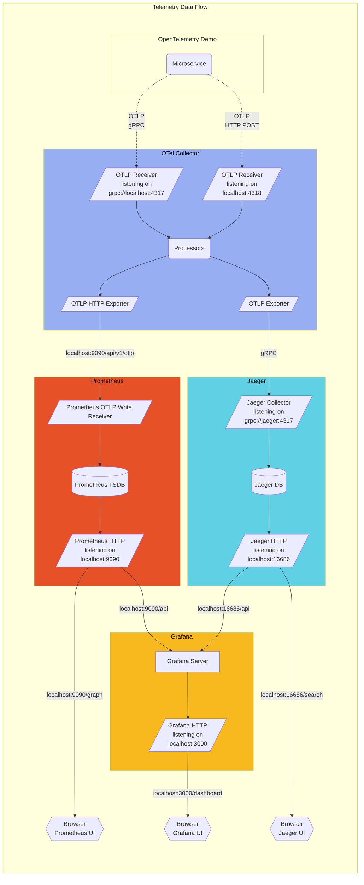

# Running OpenTelemetry Demo in Telemetry-Only Mode

This guide explains how to run just the telemetry components of the OpenTelemetry Demo while disabling the core demo services. This configuration is useful when you want to:

1. Run a lightweight version with minimal resources
2. Use the telemetry stack for monitoring your own applications
3. Explore Jaeger and Grafana without the demo services

## Based on OpenTelemetry Demo Architecture

- https://opentelemetry.io/docs/demo/architecture/




## Setup Instructions

### 1. Create the Telemetry-Only Compose File

Save the provided `docker-compose-telemetry-only.yml` file to your OpenTelemetry Demo directory.

### 2. Start the Telemetry-Only Stack

Run the following command to start just the telemetry components:

```bash
docker compose -f docker-compose-telemetry-only.yml up -d
```

### 3. Access the Telemetry UIs

Once the services are up and running, you can access:

- **Jaeger UI**: http://localhost:8080/jaeger/ui/
- **Grafana**: http://localhost:8080/grafana/
- **Prometheus**: http://localhost:9090

## How It Works

This configuration:

1. **Keeps all telemetry components**:
   - OpenTelemetry Collector
   - Jaeger
   - Grafana
   - Prometheus
   - OpenSearch

2. **Uses minimal dummy services** for essential dependencies:
   - A minimal Nginx container for the frontend
   - Alpine-based dummy containers for other required services

3. **Configures the frontend-proxy (Envoy)** to route UI requests to the appropriate telemetry UIs

## Sending Telemetry from Your Applications

You can now send telemetry data from your own applications to this stack:

1. **For traces and metrics**:
   ```
   OTEL_EXPORTER_OTLP_ENDPOINT=http://localhost:4317
   ```

2. **For HTTP-based OTLP export**:
   ```
   OTEL_EXPORTER_OTLP_ENDPOINT=http://localhost:4318
   ```

## Resource Requirements

This configuration requires significantly fewer resources than the full demo:

- **RAM**: ~1.9GB (vs ~6GB for the full demo)
- **CPU**: Minimal usage compared to the full demo
- **Disk**: ~2GB of Docker image storage

## Troubleshooting

If you encounter issues:

1. **Verify service status**:
   ```bash
   docker compose -f docker-compose-telemetry-only.yml ps
   ```

2. **Check service logs**:
   ```bash
   docker compose -f docker-compose-telemetry-only.yml logs otel-collector
   docker compose -f docker-compose-telemetry-only.yml logs frontend-proxy
   ```

3. **Verify port accessibility**:
   ```bash
   curl -I http://localhost:8080/grafana/
   curl -I http://localhost:8080/jaeger/ui/
   ```

4. **Ensure collector is accessible**:
   ```bash
   curl -I http://localhost:4318
   ```

## Returning to Full Demo Mode

To switch back to the complete demo:

```bash
# Stop telemetry-only mode
docker compose -f docker-compose-telemetry-only.yml down

# Start full demo
docker compose up -d
```
