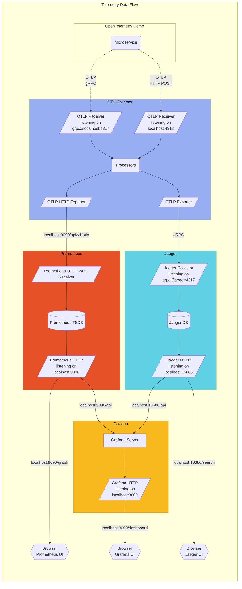

# Running OpenTelemetry Demo in Telemetry-Only Mode

This guide explains how to run just the telemetry components of the OpenTelemetry Demo without the core demo services. This lightweight configuration is ideal for:

- Running with minimal resource consumption
- Monitoring your own applications with a complete telemetry stack
- Exploring Jaeger and Grafana functionality independently

## Architecture Overview

This setup is based on the [OpenTelemetry Demo Architecture](https://opentelemetry.io/docs/demo/architecture/).



## Quick Start

### 1. Launch the Stack

```bash
docker compose -f docker-compose-telemetry-only.yml up -d
```

### 2. Access the UIs

- **Jaeger**: [http://localhost:8080/jaeger/ui/](http://localhost:8080/jaeger/ui/)
- **Grafana**: [http://localhost:8080/grafana/](http://localhost:8080/grafana/)
- **Prometheus**: [http://localhost:9090](http://localhost:9090)

## Implementation Details

This configuration:

- **Retains all telemetry components** (OTel Collector, Jaeger, Grafana, Prometheus, OpenSearch)
- **Minimizes dependencies** using lightweight containers for required services
- **Configures frontend-proxy (Envoy)** to route requests to appropriate telemetry UIs

## Sending Your Application's Telemetry

Configure your applications to send telemetry data to this stack:

- **For gRPC-based OTLP export**:
  ```
  OTEL_EXPORTER_OTLP_ENDPOINT=http://localhost:4317
  ```

- **For HTTP-based OTLP export**:
  ```
  OTEL_EXPORTER_OTLP_ENDPOINT=http://localhost:4318
  ```

## Resource Requirements

Significantly lighter than the full demo:
- **RAM**: ~1.9GB (vs ~6GB for full demo)
- **CPU**: Minimal usage
- **Disk**: ~2GB for Docker images

## Troubleshooting

If you encounter issues:

```bash
# Check service status
docker compose -f docker-compose-telemetry-only.yml ps

# View logs
docker compose -f docker-compose-telemetry-only.yml logs otel-collector
docker compose -f docker-compose-telemetry-only.yml logs frontend-proxy

# Verify endpoint accessibility
curl -I http://localhost:8080/grafana/
curl -I http://localhost:8080/jaeger/ui/
curl -I http://localhost:4318
```

## Switching Back to Full Demo

```bash
# Stop telemetry-only stack
docker compose -f docker-compose-telemetry-only.yml down

# Start full demo
docker compose up -d
```